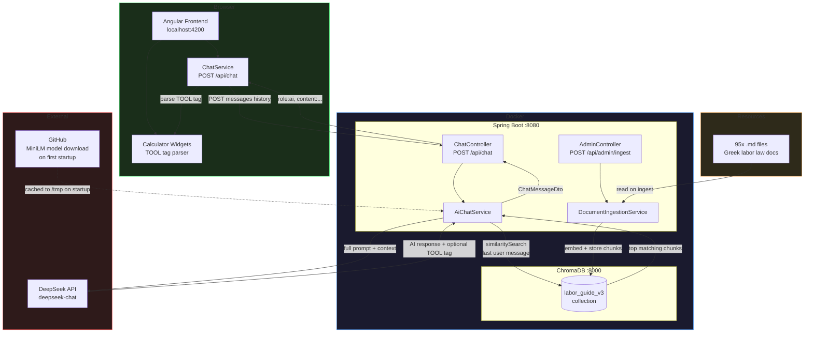

```mermaid
flowchart TD
    subgraph Browser
        A[Angular Frontend\nlocalhost:4200]
        A1[ChatService\nPOST /api/chat]
        A2[Calculator Widgets\nTOOL tag parser]
        A --> A1
        A --> A2
    end

    subgraph Docker
        subgraph backend[Spring Boot :8080]
            B1[ChatController\nPOST /api/chat]
            B2[AiChatService]
            B3[AdminController\nPOST /api/admin/ingest]
            B4[DocumentIngestionService]
            B1 --> B2
            B3 --> B4
        end

        subgraph chroma[ChromaDB :8000]
            C1[(labor_guide_v3\ncollection)]
        end
    end

    subgraph External
        D[DeepSeek API\ndeepseek-chat]
        E[GitHub\nMiniLM model download\non first startup]
    end

    subgraph Resources
        F[95x .md files\nGreek labor law docs]
    end

    A1 -->|POST messages history| B1
    B2 -->|similaritySearch\nlast user message| C1
    C1 -->|top matching chunks| B2
    B2 -->|full prompt + context| D
    D -->|AI response + optional TOOL tag| B2
    B2 -->|ChatMessageDto| B1
    B1 -->|role:ai, content:...| A1
    A1 -->|parse TOOL tag| A2

    B4 -->|embed + store chunks| C1
    F -->|read on ingest| B4
    E -.->|cached to /tmp on startup| B2

    style Docker fill:#1a1a2e,stroke:#4a9eff
    style Browser fill:#1a2e1a,stroke:#4aff7a
    style External fill:#2e1a1a,stroke:#ff4a4a
    style Resources fill:#2e2a1a,stroke:#ffaa4a
```
